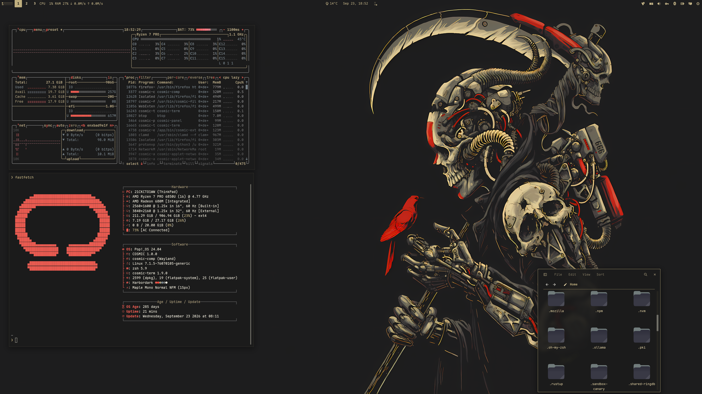

<div align="center">

# Pop!_OS · COSMIC · DarkGold

Sibling rice to [Pop_OS-Cosmic-Monochrome](https://github.com/atraxsrc/Pop_OS-Cosmic-Monochrome)
and [Pop_OS-Cosmic-TokyoNight](https://github.com/atraxsrc/Pop_OS-Cosmic-TokyoNight).
Same machine, same COSMIC desktop, Harbor Dark gold instead of gray or Tokyo Night blue.

Inspired by [omarchy-harbordark-theme](https://github.com/HANCORE-linux/omarchy-harbordark-theme).


</div>

Keep the Monochrome / Tokyo Night repos. Import this `.ron` when you want the gold look.
Firefox uses the [harbordark](https://addons.mozilla.org/en-US/firefox/addon/harbordark/) add-on.
Icons: [Kanagawa](https://github.com/Fausto-Korpsvart/Kanagawa-GKT-Theme/tree/main/icons/Kanagawa).

---


## Palette

Harbor Dark.

| Role | Color | Hex |
|------|-------|-----|
| Background |  Charcoal | `#1B1B1B` |
| Foreground |  Parchment | `#efebdc` |
| Cream |  Bone | `#E1CE98` |
| Gold |  Accent | `#C0AF7F` |
| Brass |  Secondary | `#a99b7a` |
| Salmon |  Cool accent | `#e58980` |
| Coral |  Headers | `#e75a50` |
| Error |  Red | `#F44336` |
| Slate |  Muted metal | `#77838a` |
| Dim |  Comments | `#6d6d6d` |
| Olive |  Bright-black | `#817f68` |

---

## Repo Structure

```
.
├── assets
│   └── screenshot.png           # README screenshot
├── btop
│   └── DarkGold.theme           # btop colour theme
├── cosmic
│   ├── DarkGold.ron             # COSMIC Appearance import (Dark)
│   └── DarkGold-Light.ron       # COSMIC Appearance import (Light)
├── cosmic-term
│   ├── DarkGold-term.ron        # COSMIC Terminal colour scheme (Harbor Dark)
│   └── DarkGold-Light-term.ron  # COSMIC Terminal colour scheme (Harbor Light)
├── fastfetch
│   ├── config.jsonc             # Harbor Dark fastfetch config
│   ├── cosmic.txt               # COSMIC logo
│   └── install.sh
├── firefox
│   ├── chrome
│   │   ├── userChrome.css
│   │   └── userContent.css
│   ├── install.sh
│   └── README.md
├── scripts
│   └── update_system.sh         # nala + flatpak, Harbor Dark ANSI
├── LICENSE
└── README.md
```

Shell dotfiles stay in the Tokyo Night repo.

Built from the Monochrome repo layout:
https://github.com/atraxsrc/Pop_OS-Cosmic-Monochrome

---

## COSMIC Desktop

Settings → Desktop → Appearance → **Dark** → **Import** → `cosmic/DarkGold.ron`

Accent is gold `#C0AF7F`. Use the `+` control if you want a custom swatch.

Frosted glass is on in the `.ron` at `frosted: VeryLow` for windows, panel,
applets and system UI (maximized apps stay solid). Adjust it on Appearance →
Style → Frosted glass after import; those sliders survive a theme switch.

Export from Appearance if you tweak backgrounds / tints so you do not lose them.

---

## COSMIC Terminal

The desktop `.ron` does not colour ANSI text.

1. COSMIC Terminal → **View → Color schemes…** (not Settings → Appearance)
2. Dark tab → **Import** → `cosmic-term/DarkGold-term.ron`
3. View → Settings → Appearance → Color scheme (dark) → **Harbor Dark**

If a profile is set as default, set the scheme on that profile too or the
dropdown will look like it did nothing.

Nala progress boxes use Rich `green`. In this scheme that slot is gold `#C0AF7F`.

---

## Light mode

COSMIC keeps a separate theme for Dark and Light, so the light look needs its
own import. Import both once and the Dark / Light toggle (or auto-switch)
flips between them.

**Desktop:** Settings → Desktop → Appearance → **Light** → **Import** →
`cosmic/DarkGold-Light.ron`

**Terminal:** View → Color schemes… → **Light** tab → **Import** →
`cosmic-term/DarkGold-Light-term.ron`, then View → Settings → Appearance →
Color scheme (light) → **Harbor Light**

Same palette, flipped: a darker parchment window background with lighter
cards on top so panels stand out, charcoal text, and deeper shades of the
accents so they stay readable (all at least 4.5:1 contrast on the window
background).

| Role | Dark | Light |
|------|------|-------|
| Background | `#1B1B1B` | `#D9D1B8` |
| Containers | `#2A2A29` / `#3C3C39` | `#EFEBDC` / `#F8F6EE` |
| Text | `#EFEBDC` | `#1B1B1B` |
| Accent (gold) | `#C0AF7F` | `#655628` |
| Success (brass) | `#A99B7A` | `#5E5545` |
| Salmon | `#E58980` | `#89433C` |
| Coral | `#E75A50` | `#A23026` |
| Error | `#F44336` | `#B01A1A` |
| Slate | `#77838A` | `#4A545A` |

Spacing, corners, gaps and frosted glass match the dark theme.

Not covered yet: the harbordark Firefox add-on and `firefox/chrome/` are
dark only, and `update_system.sh` uses light text colours that are hard to
read on a light terminal.

---

## Firefox

Two layers:

1. **Theme (colours):** install
   **[harbordark on addons.mozilla.org](https://addons.mozilla.org/en-US/firefox/addon/harbordark/)**.
   This is the main look.
2. **Stylesheets (optional):** `firefox/chrome/` adds rounded corners, gold
   menu hover, gold accents and blank new-tab tiles on top of the add-on
   (they also work with Firefox's built-in Dark theme):

```bash
chmod +x firefox/install.sh
./firefox/install.sh
```

Fully quit Firefox afterward. Details: [`firefox/README.md`](firefox/README.md).

---

## Wallpaper

Wallpapers live in [cool-wallpapers](https://github.com/atraxsrc/cool-wallpapers),
so this repo stays small. The ones used with this rice:

| File | Size | Notes |
|------|------|-------|
| [`cosmic/cosmic-astronaut-black-8000x4500.png`](https://github.com/atraxsrc/cool-wallpapers/blob/main/cosmic/cosmic-astronaut-black-8000x4500.png) | 8000x4500, ~46 MB | Upscaled with Upscayl (ultramix-balanced) |
| [`cosmic/cosmic-astronaut-black-starred-7488x4224.png`](https://github.com/atraxsrc/cool-wallpapers/blob/main/cosmic/cosmic-astronaut-black-starred-7488x4224.png) | 7488x4224, ~7.5 MB | Upscaled with Upscayl (digital-art) |
| [`harbor-dark/reaper-skull-13760x5760.jpg`](https://https://github.com/atraxsrc/cool-wallpapers/blob/main/harbor-dark/reaper-skull-13760x5760.jpg) | 13760x5760, ~5.2 MB | Upscaled with Upscayl (digital-art) |

More Harbor Dark and gold astronaut variants are in
[`cosmic/`](https://github.com/atraxsrc/cool-wallpapers/tree/main/cosmic) and
[`harbor-dark/`](https://github.com/atraxsrc/cool-wallpapers/tree/main/harbor-dark).

Download one, then Settings → Desktop → Wallpaper → **Add image** → pick the file.

---

## Icons

[Kanagawa icons](https://github.com/Fausto-Korpsvart/Kanagawa-GKT-Theme/tree/main/icons/Kanagawa)
from [Fausto-Korpsvart/Kanagawa-GKT-Theme](https://github.com/Fausto-Korpsvart/Kanagawa-GKT-Theme).

Drop the icon pack into `~/.local/share/icons/` and pick it in COSMIC Settings
→ Desktop → Appearance → Icons.

---

## Terminal extras

Both need a [Nerd Font](https://www.nerdfonts.com/) in the terminal for the icons
(the screenshot uses Maple Mono NFM).

### fastfetch

`fastfetch/` holds a Harbor Dark config with a COSMIC logo in coral and
Hardware / Software / Age boxes. `install.sh` backs up any existing
`~/.config/fastfetch/config.jsonc` to `config.jsonc.bak` before copying.

```bash
./fastfetch/install.sh
fastfetch
```

### btop

`btop/DarkGold.theme` uses the same palette: charcoal background, coral highlights, brass titles.

```bash
mkdir -p ~/.config/btop/themes
cp btop/DarkGold.theme ~/.config/btop/themes/
# btop → Esc → Options → Color theme → DarkGold
```

---

## Scripts

### `update_system.sh`

Same updater as Monochrome / Tokyo Night. Headers are coral, success is cream,
the figlet ramp is olive → gold → cream.

```bash
chmod +x scripts/update_system.sh
./scripts/update_system.sh
```

---

## Setup

```bash
git clone https://github.com/atraxsrc/Pop_OS-Cosmic-DarkGold.git
cd Pop_OS-Cosmic-DarkGold

# desktop
# Settings → Appearance → Dark → Import cosmic/DarkGold.ron

# terminal
# View → Color schemes → Import cosmic-term/DarkGold-term.ron

# light mode (optional)
# Appearance → Light → Import cosmic/DarkGold-Light.ron
# Terminal → Color schemes → Light → Import cosmic-term/DarkGold-Light-term.ron

# firefox add-on
# https://addons.mozilla.org/en-US/firefox/addon/harbordark/

# optional extra chrome
# ./firefox/install.sh

# fastfetch + btop (see Terminal extras above)
./fastfetch/install.sh
mkdir -p ~/.config/btop/themes && cp btop/DarkGold.theme ~/.config/btop/themes/

# wallpaper
# Settings → Wallpaper → Add image → a file from
# https://github.com/atraxsrc/cool-wallpapers (see Wallpaper above)

# icons
# https://github.com/Fausto-Korpsvart/Kanagawa-GKT-Theme/tree/main/icons/Kanagawa
```

---

## Switch back

1. Appearance → Dark → Import `cosmic/Monochrome-Dark.ron` (Monochrome repo)
   or `cosmic/TokyoNight.ron` (Tokyo Night repo)
2. Terminal → import Monochrome's `cosmic-term/Monochrome-Dark-term.ron`, or
   pick your previous scheme for Tokyo Night (no terminal file in that repo)
3. Disable or replace the [harbordark](https://addons.mozilla.org/en-US/firefox/addon/harbordark/) add-on,
   then run the other repo's `firefox/install.sh`

---

## Stack

| Tool | What it does |
|------|-------------|
| [Pop!_OS 24.04](https://pop.system76.com/) | Base OS by System76 |
| [COSMIC DE](https://system76.com/cosmic) | Desktop environment |
| [omarchy-harbordark-theme](https://github.com/HANCORE-linux/omarchy-harbordark-theme) | Palette inspiration |
| [harbordark](https://addons.mozilla.org/en-US/firefox/addon/harbordark/) | Firefox theme |
| [fastfetch](https://github.com/fastfetch-cli/fastfetch) | System info |
| [btop](https://github.com/aristocratos/btop) | Resource monitor |
| [Kanagawa icons](https://github.com/Fausto-Korpsvart/Kanagawa-GKT-Theme/tree/main/icons/Kanagawa) | Icon pack |
| [Pop_OS-Cosmic-Monochrome](https://github.com/atraxsrc/Pop_OS-Cosmic-Monochrome) | Layout source |
| This repo | Harbor Dark / DarkGold on COSMIC |

## License

MIT
