# COSMIC Terminal schemes

Colour schemes for COSMIC Terminal. The desktop `.ron` in `cosmic/` does not
colour ANSI text, so the terminal needs its own import.

1. COSMIC Terminal → **View → Color schemes…** (not Settings → Appearance)
2. **Dark** or **Light** tab → **Import** → a `.ron` from this folder
3. View → Settings → Appearance → Color scheme (dark / light) → the scheme name

If a profile is set as default, set the scheme on that profile too or the
dropdown will look like it did nothing. `cosmic/install.sh` selects
**Harbor Dark** and **Harbor Light**, so import those two at least.

The gold and slate schemes keep the 16 ANSI colours of Harbor Dark / Harbor
Light. Only the plain text colour, cursor and dim text change, so bat, lsd,
starship, nala and btop look the same whichever one you pick.

## Which one

| Desktop text tint | Dark | Light |
|-------------------|------|-------|
| Default (`DarkGold.ron` / `DarkGold-Light.ron`) | Harbor Dark | Harbor Light |
| Gold (`*-fixed-text.ron`) | Harbor Dark Gold | Harbor Light Gold |
| Any, cool grey text | a Harbor Dark slate shade | a Harbor Light slate shade |

The slate shades come from btop's main text colour `#77838A`. Lower in each
list is higher contrast: Slate is as dim as btop, Silver / Ink are the easiest
to read. Gold, salmon and red output stand out more against slate text than
against cream or gold.

**Bold:** `bright_foreground` only colours bold text when `use_bright_bold` is
on. The baseline config in `cosmic/config/` leaves it off, so bold text is the
plain text colour at weight 800.

Previews below are rendered in Fira Mono on the theme background (`#1B1B1B` /
`#D9D1B8`), not taken from the terminal. In COSMIC you get Maple Mono at 77%
opacity, so text looks a little softer.

## Dark

**Harbor Dark** · `DarkGold-term.ron` · cream `#EFEBDC`, 14.4:1. The default.

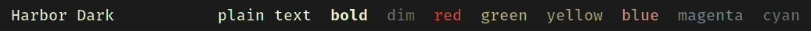

**Harbor Dark Muted** · `DarkGold-term-muted.ron` · cream `#EFEBDC`, 14.4:1.
Separate bright and dim shades of each colour (Harbor Dark reuses the normal
ones), warm grey dim text and a gold cursor.

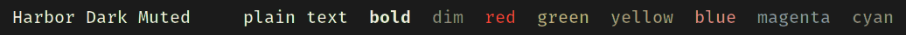

**Harbor Dark Gold** · `DarkGold-term-gold.ron` · gold `#E1CE98`, 11.1:1.
The wallpaper's bone highlight, pairs with the gold text tint. Plain text
sits close to the gold `green` slot.

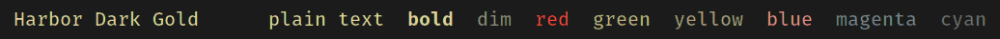

**Harbor Dark Slate** · `DarkGold-term-slate.ron` · `#77838A`, 4.4:1.
btop's main text. Good for a dim, low-glare look, tiring for long reading,
and plain text matches the `magenta` slot.

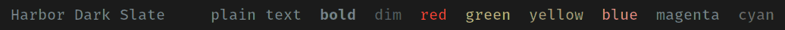

**Harbor Dark Pewter** · `DarkGold-term-pewter.ron` · `#8A959C`, 5.6:1.

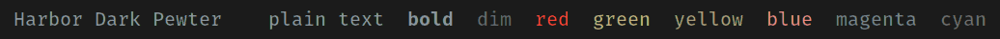

**Harbor Dark Steel** · `DarkGold-term-steel.ron` · `#9BA2A6`, 6.7:1.
The desktop's `accent_indigo`.

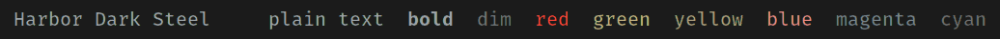

**Harbor Dark Mist** · `DarkGold-term-mist.ron` · `#B4BCC0`, 8.9:1.

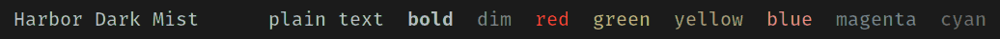

**Harbor Dark Silver** · `DarkGold-term-silver.ron` · `#C9CFD2`, 10.9:1.
About as bright as the gold scheme.

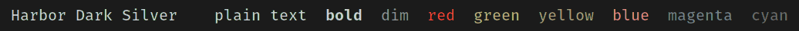

## Light

**Harbor Light** · `DarkGold-Light-term.ron` · charcoal `#1B1B1B`, 11.3:1.
The default.

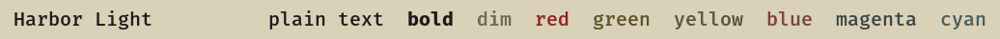

**Harbor Light Gold** · `DarkGold-Light-term-gold.ron` · dark gold `#4F431F`,
6.4:1. Pairs with the gold text tint.

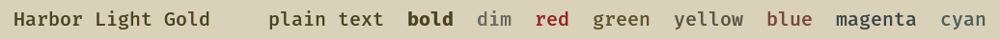

**Harbor Light Slate** · `DarkGold-Light-term-slate.ron` · `#525A5F`, 4.6:1.

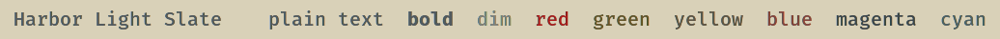

**Harbor Light Pewter** · `DarkGold-Light-term-pewter.ron` · `#464D52`, 5.6:1.

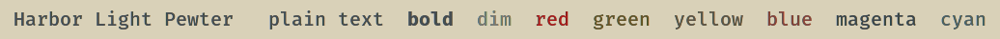

**Harbor Light Steel** · `DarkGold-Light-term-steel.ron` · `#3C4246`, 6.7:1.

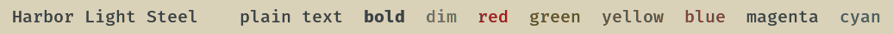

**Harbor Light Graphite** · `DarkGold-Light-term-graphite.ron` · `#2A2E31`, 9.0:1.

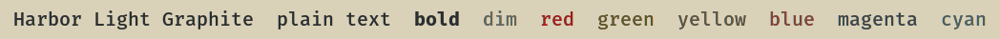

**Harbor Light Ink** · `DarkGold-Light-term-ink.ron` · `#1C1E20`, 11.0:1.
Charcoal with a faint slate cast.

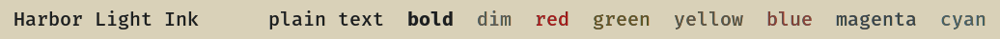

**Warm Ember Light** · `DarkGold-Light-term-ember.ron` · charcoal `#1B1B1B`,
11.3:1. An older alternate: coral in the `green` slot and steel blue in the
`blue` slot, so it does not follow the Harbor Light palette.

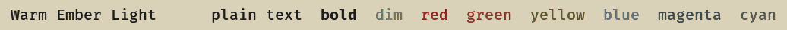

Contrast is plain text on the theme background, WCAG 2.
